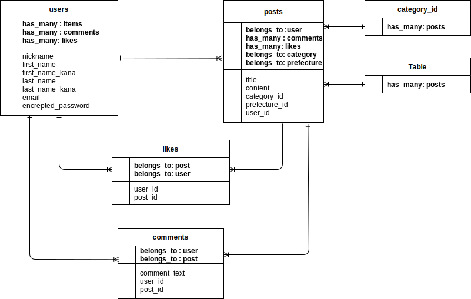

# アプリケーション名
Fathers

# アプリケーションの概要
出産、育児に関して父親たちの為の情報共有サイト。出産を迎えるに当たって準備物のおすすめを聞いたり、子供と遊べるスポットを
共有したりなど出産準備、育児、子育てに関する情報を共有するサイト。

# URL
今後記載予定

# テスト用アカウント
・Basic認証パスワード : beck  
・Basic認証ID : 0629  
・メールアドレス : test@test.jp  
・パスワード : test0000  

# 利用方法

## 情報投稿
1.トップページのヘッダーからユーザー新規登録を行う  
2.投稿ボタンから共有したい情報、悩みなどを投稿  
入力内容:タイトル・詳細・カテゴリー(必須)、画像・都道府県(任意)

## 悩みへのアドバイス、父親たちのコミュニケーション
1.投稿をクリックして投稿詳細ページからコメントができる  
2.投稿内容へのアドバイスや質問があればコメントをする  
3.参考になる情報や良い投稿にはお気に入りをする  

# アプリケーションを作成した背景
私の妻は現在出産を控えています。出産準備に当たってベビーカーや抱っこ紐など必要な物をwebで調べていましたが情報量が多くなかなか決めることができませんでした。その時に実際に出産を経験されている方の意見を聞いてみたいと思いました。今後、子育てを行っていくにあたっても経験をされている方々の意見を参考にできたらいいなと思いました。さらに、母親の悩みや情報を共有するサイトは多く目にしますが、それの父親バージョンはあまり見たことがないなと思いこのFathersというアプリケーションを開発しようと思いました。

# 洗いだした要件
[要件を定義したシート](https://docs.google.com/spreadsheets/d/1hVVKQXkf6MLay8krKafMPSrcfvHw9q8LB5TFcOgnKhc/edit#gid=982722306)

# 実装した機能についての画像やGIFおよびその説明
実装が進み次第記載予定

# 実装予定の機能
お気に入り機能を実装予定

# データベース設計

# 画面遷移図

# 開発環境
サーバーサイド：Ruby on Rails  
フロントサイド：HTML, CSS  
テスト：RSpec  
エディタ：VScode
タスク管理 : Github

# ローカルでの動作方法
% git clone <リモートリポジトリのURL>  
% cd fathers_app  
% bundle install  
% yarn install  
% rails db:create  
% rails db:migrate  
% rails s  

# 工夫したポイント
制作前なので今後、制作中に工夫した点を追記していきたいと思います。